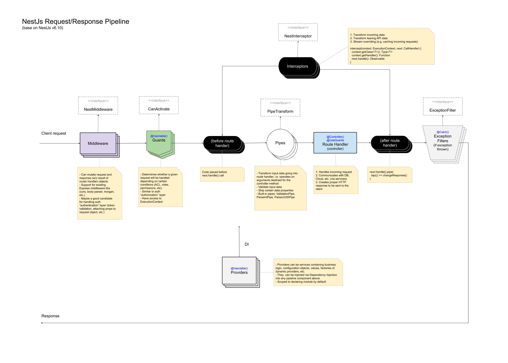

### 의존성 구조
- repository
  - db/entity
  - 

## 디렉토리 구조 및 파일명 규칙과 예시
참고: https://sumini.dev/guide/019-nestjs-directory-structure/

index.ts: 외부로 노출할 모듈을 모아놓는다. (로직은 없다.)

### config
config/[필요시 대분류]/{사용 목적}/{사용 목적}.conf.ts, {사용 목적}.conf.{service, module, validation}.ts, index.ts
- 일부는 도메인 비의존적 & 일부는 도메인 의존적
- 참고: https://medium.com/the-crowdlinker-chronicle/creating-config-files-in-nestjs-dcd059ae15e4
- 이름 {사용목적 대문자} 그리고 process.env.{대분류 대문자}_{소분류 대문자}_{필드 대문자} 형식으로 환경변수를 사용한다.
- 실제 설정 파일은 ./.env 파일에 둔다
- process.env.NODE_ENV 에 따라서 설정 파일을 다르게 사용한다. (.default.env, .dev.env, .prod.env, .local.env, .test.env, .staging.env, .qa.env)
- {사용 목적}.conf.ts
  - 기본값 설정 및 process.env.* 에서 값을 읽어온다.
- {사용 목적}.conf.service.ts
  - {사용 목적}.conf.ts 에서 읽어온 값을 사용하여 getter 를 제공한다.
- {사용 목적}.conf.module.ts
  - ConfigModule.forRoot() 를 사용하여 설정을 초기화한다.
- {사용 목적}.conf.validation.ts
  - {사용 목적}.conf.ts 에서 읽어온 값을 검증한다. (class-validator, class-transformer)

  
### auth
인증 관련
- 참고
  - [x] https://docs.nestjs.com/security/authentication
  - [ ] https://docs.nestjs.com/security/authorization
    - 기반 지식
      - Basic RBAC
      - Claims-based authorization
      - role vs permission
      - RBAC vs ABAC
      - 아래는.. 머여 자동으로 ai 가 적어줌
      - RBAC vs ACL
      - RBAC vs MAC
      - RBAC vs DAC
      - RBAC vs CAP
    - 확인해야할 라이브러리
      - @casl/ability
      - accesscontrol
      - acl
- auth/index.ts
- auth/auth.module.ts
- auth/auth.service.ts
- auth/auth.controller.ts
- auth/auth.guard.ts
- auth/auth.strategy.ts
- auth/auth.interceptor.ts
- auth/auth.filter.ts
- auth/auth.exception.ts
- auth/auth.pipe.ts
- auth/auth.decorator.ts
- auth/auth.provider.ts
- auth/auth.factory.ts
- auth/auth.repository.ts
- auth/auth.entity.ts
- auth/auth.dto.ts
- auth/auth.enum.ts
- auth/auth.interface.ts
- auth/auth.type.ts
- auth/auth.middleware.ts
- 
- 
- auth/guard
- auth/interceptor
- ...
이후 적용은 데코레이터를 사용하여 적용한다.

### controller
controller/{분류}/{분류}.controller.ts, {분류}.controller.{service, module}.ts, {분류}.dto.ts, index.ts
- 도메인 의존적
- controller: routing 역할.
- module: 의존 서비스를 정의후 controller 에서 DI 받아서 사용, 외부 service 의 설정
- dto: controller 에서 사용하는 dto
- service 는 외부 서비스를 인터페이스에 맞게 변환(adapter)

### service
service/{분류}/{분류}.service.ts, {분류}.service.module.ts, index.ts
- 도메인 의존적
- service: 비즈니스 로직을 담당한다.

### lib
lib/[필요시 대분류]/{엔진 명}/{엔진 명}.lib.ts, {엔진 명}.lib.{service, module}.ts, index.ts
- 도메인 비의존적
- 외부 엔진을 사용하는 공통 라이브러리. 도메인 논리를 포함하지 않는다.

### db
db/db.module.ts, db/{분류}/{분류}.db.entity.ts, {분류}.db.service.ts, {분류}.db.module.ts, index.ts
- 도메인 의존적
- db/db.module.ts: db 연결 설정
- {분류}.db.service.ts: 사용하기 편하게 만든 db service
- {분류}.db.module.ts: db.forFeature() 를 사용하여 db 연결 설정, {분류}.db.service.ts 를 DI 받아서 사용, export service

---
이후 구조는 우선 skip

### filter
controller 에서 throw 시에 응답하는 데이터의 변환
[example](https://github.com/nestjs/nest/blob/master/integration/graphql-code-first/src/common/filters/unauthorized.filter.ts)
- filter/{name}.filter.ts

### pipe
요청 값의 변환, 유효성 검사, 예외 처리
- pipe/{name}.pipe.ts
  - validation.pipe.ts
  - transform.pipe.ts
  - parse.pipe.ts
  - ...

### guard
권한, 인증, 인가, 토큰 검사
- guard/{name}.guard.ts
  - JwtAuthGuard
  - RolesGuard
  - ...

### interceptor
- interceptor/{name}.interceptor.ts
  - logger
  - error
  - auth
  - ...

### middleware (없음)
더 괜찮은 interceptor 로 구현한다.
오직 express 에서 제공하는 middleware 를 사용할 때 사용한다.

### bin(schedule)
딱히 사용할 일은 없을듯 하다
- bin/{name}.bin.ts

참고할 문서

- https://docs.nestjs.com/techniques/validation
- https://docs.nestjs.com/techniques/configuration
- https://docs.nestjs.com/techniques/http-module
- https://docs.nestjs.com/security/encryption-and-hashing
  - DB 에 의존하기보다 서버에서 처리하자
- https://docs.nestjs.com/custom-decorators#custom-route-decorators

auth

websocket
- https://docs.nestjs.com/websockets/gateways

낮은 우선순위
- https://docs.nestjs.com/recipes/terminus
- https://docs.nestjs.com/recipes/cqrs
- https://docs.nestjs.com/recipes/documentation
- https://docs.nestjs.com/techniques/versioning
- https://docs.nestjs.com/techniques/serialization
- https://docs.nestjs.com/techniques/caching
- https://docs.nestjs.com/techniques/logger
- https://docs.nestjs.com/security/rate-limiting
- https://docs.nestjs.com/openapi/introduction
- https://docs.nestjs.com/recipes/terminus
  - https://termius.com/

websocket vs long polling
- https://ably.com/blog/websockets-vs-long-polling
결론: websocket 으로 ㄱ

### Nest
- controller
- service
- module
- middleware
- guard
- interceptor
- filter
- exception
- pipe
- decorator
- provider
- factory
- repository
- entity
- dto
- enum
- interface
- type